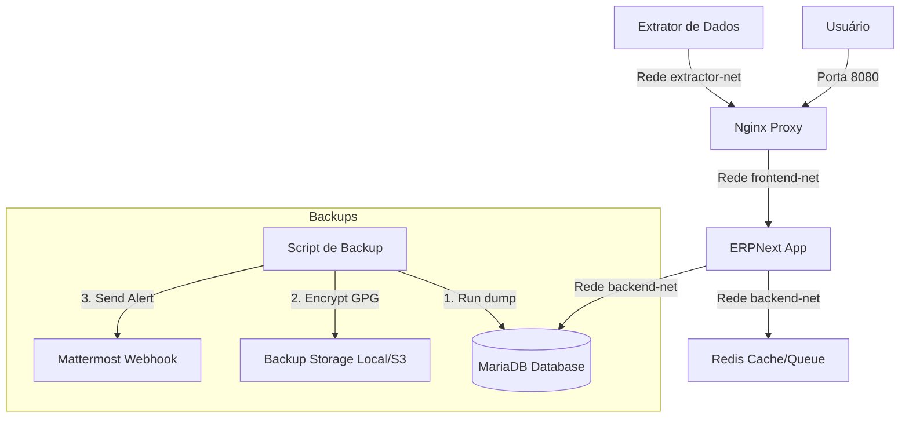

# NextERP - CDC Migração


Este repositório gerencia o planejamento, a homologação e a execução segura da migração do ambiente ERPNext legado hospedado na GCP para uma VPS na Hostinger, utilizando contêineres Docker Compose e isolamento de redes.

---

## 📐 Arquitetura do Sistema

O diagrama abaixo ilustra o fluxo de dados dos usuários e o fluxo operacional de backups automatizados com integração de alertas para o Mattermost:



---

## 📂 Estrutura de Diretórios

```text
NextERP/
├── docs/                             # Documentação técnica padronizada do projeto
│   ├── diretrizes_documentacao.md    # Governança e regras de evolução de docs
│   ├── estrategia_execucao.md        # Branches, ambientes e processos de deploy
│   ├── migration_guide.md            # Diagnóstico da VM GCP, downloads e SSH
│   ├── ajuda_infra.md                # Docker Compose, redes e portas
│   ├── postmortem.md                 # Template blameless de análise de falhas
│   ├── troubleshooting.md            # Manual de resolução de problemas recorrentes
│   ├── politica_backup.md            # Script de backup, criptografia e restore
│   ├── descoberta_gcp.md             # Histórico de credenciais e mapeamento da produção antiga
│   └── prompt_ia.md                  # Hub de IA e receitas operacionais
├── .env.example                      # Modelo público das variáveis de ambiente
└── .gitignore                        # Regras de exclusão do Git (segredos e backups)
```

---

## 📋 Requisitos Mínimos

| Componente | Versão mínima | Finalidade |
| :--- | :---: | :--- |
| Docker Engine | 20.10+ | Runtime de contêineres |
| Docker Compose | 2.0+ | Orquestração dos microsserviços |
| GnuPG (GPG) | 2.2+ | Criptografia dos pacotes de backup |
| OpenSSH | 8.0+ | Conexões SSH criptografadas e seguras |

---

## ⚙️ Configuração do Ambiente

1. Crie o arquivo de variáveis local na raiz do repositório:
   ```bash
   cp .env.example .env
   ```
2. Abra o arquivo `.env` e preencha as variáveis de banco de dados, e-mail e Mattermost com os dados reais do ambiente.

> [!WARNING]
> **Segurança de credenciais**: O arquivo `.env` contém segredos críticos e webhooks reais do Mattermost. Ele nunca deve ser enviado ao repositório Git ou exposto em logs públicos.

---

## 🚀 Inicialização (Laboratório Local)

Para subir o ambiente de testes na sua máquina openSUSE, execute a sequência de passos abaixo:

1. **Configurar as Variáveis**: Execute o passo de cópia e edição do `.env` acima.
2. **Subir os Contêineres**:
   ```bash
   docker compose up -d
   ```
3. **Restaurar Banco de Dados**: Copie o backup do MariaDB e restaure conforme descrito em [politica_backup.md](./docs/politica_backup.md).
4. **Executar Migrações e Atualizar Cache**:
   ```bash
   docker exec -it erpnext-app bench --site site1.local migrate
   docker exec -it erpnext-app bench --site site1.local clear-cache
   ```
5. **Criar Usuário Administrador (Opcional)**:
   ```bash
   docker exec -it erpnext-app bench --site site1.local set-admin-password <SUA_SENHA>
   ```
6. **Verificar Conexão e Logs**: Cheque o acesso na porta `8080` do seu navegador e acompanhe os logs operacionais.

---

## 🔧 Cheat Sheet (Comandos Rápidos)

```bash
# Iniciar todos os contêineres do projeto
docker compose up -d

# Parar serviços (mantendo dados persistentes)
docker compose down

# Forçar reconstrução da imagem do Extrator de Dados
docker compose up -d --build data-extractor

# Acompanhar logs de erros dos contêineres
docker compose logs -f --tail=50

# Executar backup manual criptografado com GPG
sudo bash /opt/backup_scripts/backup_erpnext.sh

# Testar o webhook de alertas do Mattermost
curl -X POST -H "Content-Type: application/json" -d '{"text":"Teste de conexão do Mattermost."}' "$MATTERMOST_WEBHOOK_URL"
```

---

## 📂 Documentação Complementar

* [Diretrizes de Documentação](./docs/diretrizes_documentacao.md) — Regras de criação, manutenção, revisão e evolução da documentação.
* [Estratégia de Execução](./docs/estrategia_execucao.md) — Desenvolvimento, branches, ambientes, releases e implantação.
* [Guia de Migração](./docs/migration_guide.md) — Acesso seguro, diagnóstico, exportação e migração de ambientes.
* [Ajuda de Infraestrutura](./docs/ajuda_infra.md) — Containers, redes, portas, DNS, variáveis e Mattermost.
* [Postmortem](./docs/postmortem.md) — Modelo sem culpabilização para análise de incidentes.
* [Troubleshooting](./docs/troubleshooting.md) — Diagnóstico e solução de problemas recorrentes.
* [Política de Backup](./docs/politica_backup.md) — Backup, criptografia, retenção, restauração e alertas no Mattermost.
* [Registro de Descoberta GCP](./docs/descoberta_gcp.md) — Histórico físico de IPs, portas, credenciais e localização de scripts da VM antiga.
* [Contexto para IA](./docs/prompt_ia.md) — Contexto arquitetural e prompts operacionais para assistentes de IA.

---

> [!IMPORTANT]
> **Sobre esta organização**: A documentação é parte integrante do produto técnico deste projeto. Mantê-la sempre atualizada e evoluí-la continuamente junto com o código, regras de infraestrutura e alertas do Mattermost é o dever de toda a equipe para garantir a estabilidade operacional e governança do sistema.
