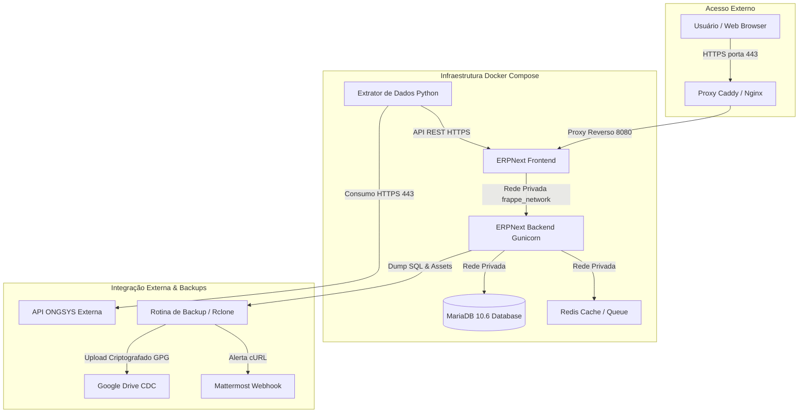

# NextERP - CDC (Gestão de Estoque & Infraestrutura)


Este repositório gerencia o planejamento, a homologação local e a execução segura da migração do sistema **NextERP** (estoque) da Google Cloud (GCP) para uma VPS na Hostinger, seguindo as diretrizes de infraestrutura e governança padrão da **CDC (`dxcdc`)**.

---

## 📐 Arquitetura do Sistema

O diagrama abaixo ilustra o fluxo de acesso dos usuários, o isolamento de microsserviços conteinerizados e o pipeline de sincronização do Extrator de Dados com parceiros externos:



---

## 📂 Estrutura de Documentação Técnica (`docs/`)

Toda a documentação do projeto está padronizada e disponível no diretório [`docs/`](./docs/):

| Documento | Descrição e Finalidade |
| :--- | :--- |
| 📘 [diretrizes_documentacao.md](./docs/diretrizes_documentacao.md) | Governança de documentação, regras de formatação e padrões de escrita. |
| 🔀 [estrategia_execucao.md](./docs/estrategia_execucao.md) | Fluxos de trabalho Gitflow, gestão de ambientes e procedimentos de rollback. |
| 🚀 [migration_guide.md](./docs/migration_guide.md) | Guia completo de migração da GCP para a Hostinger VPS e diagnósticos SSH. |
| 🛠️ [ajuda_infra.md](./docs/ajuda_infra.md) | Arquitetura física e virtual, mapa de contêineres e isolamento de redes Docker. |
| 🩺 [troubleshooting.md](./docs/troubleshooting.md) | Diagnóstico e resolução rápida de problemas recorrentes de ambiente. |
| 🔐 [politica_backup.md](./docs/politica_backup.md) | Política de backup (3-2-1), ciclo de retenção, criptografia GPG e procedimentos de restore. |
| 📋 [issues_planejamento.md](./docs/issues_planejamento.md) | Inventário com o backlog oficial de tarefas e checklists do projeto. |
| ⚙️ [guia_automacao_github.md](./docs/guia_automacao_github.md) | Guia detalhado dos fluxos de automação de CI/CD do GitHub Actions. |
| 🚨 [postmortem.md](./docs/postmortem.md) | Modelo *blameless* (sem culpabilização) para análise pós-incidente. |
| 🤖 [prompt_ia.md](./docs/prompt_ia.md) | Diretrizes e regras de contexto para assistentes de IA e desenvolvimento em dupla. |
| 🔍 [pesquisa.md](./docs/pesquisa.md) | Pesquisa de inovações da comunidade Frappe/ERPNext e especificação técnica da integração com Mattermost. |
| 📊 [relatorio_executivo_migracao.md](./docs/relatorio_executivo_migracao.md) | Relatório executivo consolidado com a Matriz das 4 Abordagens Visuais. |
| ✅ [prontidao_migracao.md](./docs/prontidao_migracao.md) | Painel qualitativo de prontidão, evidências e bloqueios da migração. |
| 👁️ [validacao_manual_visual.md](./docs/validacao_manual_visual.md) | Roteiro de homologação manual, visual e por perfil de acesso. |
| 🪞 [espelho_sombra_producao.md](./docs/espelho_sombra_producao.md) | Arquitetura segura para acompanhar eventos recentes sem escrever na produção. |
| 🗓️ [relatorio_tarefas_2026-08-01.md](./docs/relatorio_tarefas_2026-08-01.md) | Entregas, backlog priorizado e retomada planejada para segunda-feira. |

Reconciliação somente leitura entre laboratório e produção:

```bash
python3 scripts/reconcile_production_shadow.py --host usuario@servidor --identity ~/.ssh/id_ed25519
```

---

## ⚙️ Configuração e Instalação (Laboratório Local)

### 1. Requisitos Mínimos
- **Docker Engine**: `v20.10+`
- **Docker Compose**: `v2.0+`
- **GnuPG (GPG)**: `v2.2+`

### 2. Configuração de Variáveis de Ambiente
Crie o arquivo `.env` local copiando o modelo padronizado:
```bash
cp .env.example .env
```
Edite o arquivo `.env` ajustando as senhas de banco de dados e URLs de webhook.

### 3. Inicialização dos Contêineres
Suba o ambiente conteinerizado no modo desacoplado:
```bash
docker compose up -d
```
Acesse o ERPNext localmente no seu navegador em `http://localhost:8085`.

---

## 🔀 Fluxos de CI/CD com GitHub Actions

O repositório conta com duas automações configuradas no diretório `.github/workflows/`:
1. **`automatizar_issues.yml`**: Criação e sincronização automática de GitHub Issues baseadas no backlog.
2. **`auto_merge_pr.yml`**: Aprovação e fusão automática de Pull Requests validados.

---

## 📄 Licença e Propriedade
Este software e seus artefatos de infraestrutura são de propriedade exclusiva do **Centro de Defesa da Cidadania (CDC)**.
