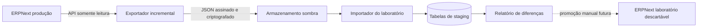

# Proposta de espelho sombra da produção

## Objetivo

Manter o laboratório próximo dos lançamentos recentes da produção sem permitir escrita na GCP, sem movimentar estoque automaticamente no laboratório e sem disparar webhooks reais.

## Decisão recomendada

Não realizar replicação direta entre os dois ERPNext. A primeira versão deve copiar eventos para uma área de **staging imutável**, usada apenas para reconciliação.



## Por que não reproduzir diretamente Stock Entry

Inserir um lançamento submetido no laboratório pode:

- movimentar o razão de estoque novamente;
- executar hooks e webhooks Mattermost;
- gerar nomes ou séries diferentes;
- falhar se item, armazém ou unidade ainda não existir;
- mascarar divergências ao transformar o dado durante a cópia;
- criar uma falsa sensação de réplica fiel.

O staging preserva o evento original e permite comparar antes de qualquer transformação.

## Modelo de segurança

- Usuário técnico exclusivo na produção, com leitura apenas de `Stock Entry`, itens e armazéns necessários.
- Nenhuma chave de escrita da produção no laboratório.
- Cursor incremental baseado em `modified` mais `name`; data sozinha não é suficiente.
- Payload com hash SHA-256, horário, origem e versão do esquema.
- Criptografia em trânsito e repouso.
- Retenção curta no staging e mascaramento de dados pessoais não necessários.
- Auditoria de cada lote recebido.
- Chave de desligamento imediato (*kill switch*).

## Fases seguras

### Fase 1 — Reconciliação sem payload

Exportar somente identificador, data, estado e hash. O laboratório compara quantidade, atrasos e divergências. Nenhum documento é criado.

O repositório inclui a implementação inicial somente leitura:

```bash
python3 scripts/reconcile_production_shadow.py \
  --host usuario@servidor \
  --identity ~/.ssh/id_ed25519
```

O resultado é salvo em `shadow_reconciliation.json`. Ele contém métricas, checksums e diferenças, mas nenhum item, usuário, credencial ou conteúdo de lançamento.

### Fase 2 — Staging completo

Exportar cabeçalho e linhas para DocTypes/tabelas de sombra. A interface mostra “observado”, “divergente” e “ausente”, sem alterar `Stock Entry`.

### Fase 3 — Replay descartável

Somente após aprovação, reconstruir os eventos em uma cópia descartável do laboratório com scheduler e Mattermost desabilitados. Apagar essa cópia ao final do teste.

## Onde executar

A opção inicial de menor risco é o laboratório buscar a produção por uma API HTTPS somente leitura. Assim, nenhum novo processo precisa ser instalado na GCP.

Se for necessário executar na VPS, o exportador deve apenas enviar arquivos para um bucket/fila; ele nunca deve conhecer credenciais de escrita do laboratório.

## Critérios antes de instalar na GCP

- [ ] Aprovação explícita do responsável pela produção.
- [ ] Usuário e papel somente leitura revisados.
- [ ] Payload sem segredos ou dados pessoais desnecessários.
- [ ] Limite de requisições e janela de execução definidos.
- [ ] Teste de carga em laboratório.
- [ ] Monitoramento, retenção e kill switch documentados.
- [ ] Prova de que nenhum endpoint de escrita é chamado.
- [ ] Plano de remoção e rollback do exportador.

## Resultado esperado

O espelho não substitui o backup. Ele reduz a defasagem da homologação e produz evidência sobre equivalência operacional. A fonte de recuperação continua sendo um backup completo e validado.
