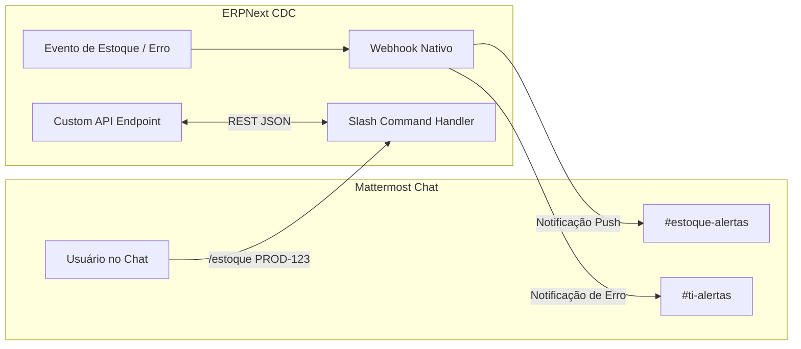

# Pesquisa de Inovações, Melhores Práticas e Integrações: NextERP (CDC)

Este documento consolida uma pesquisa aprofundada baseada em postagens no LinkedIn, fóruns da comunidade oficial da Frappe (`discuss.frappe.io`), casos de sucesso da indústria e benchmarks de mercado. O objetivo é mapear metodologias modernas e customizações viáveis para transformar o NextERP da CDC em uma ferramenta ainda mais poderosa, intuitiva e automatizada.

---

## 📌 Sumário Executivo

1. [Inovações da Comunidade & Melhores Práticas (2026)](#1-inovações-da-comunidade--melhores-práticas-2026)
   * 1.1 [Interface & UX Modernizada (Frappe UI / Vue 3 / Tailwind)](#11-interface--ux-modernizada-frappe-ui--vue-3--tailwind)
   * 1.2 [Automação com IA Generativa & Agentes (Agentic Workflows)](#12-automação-com-ia-generativa--agentes-agentic-workflows)
   * 1.3 [Acessibilidade e Personalização de Painéis (UI/UX)](#13-acessibilidade-e-personalização-de-painéis-uiux)
   * 1.4 [Desempenho e Caching de Grande Escala (Frappe Caffeine / Redis)](#14-desempenho-e-caching-de-grande-escala-frappe-caffeine--redis)
2. [Estudo Técnico: Integração Nativa com o Chat Mattermost](#2-estudo-técnico-integração-nativa-com-o-chat-mattermost)
   * 2.1 [Abordagem 1: Webhooks Nativos de Saída (Sem Código)](#21-abordagem-1-webhooks-nativos-de-saída-sem-código)
   * 2.2 [Abordagem 2: ChatOps com Slash Commands (`/estoque`)](#22-abordagem-2-chatops-com-slash-commands-estoque)
   * 2.3 [Abordagem 3: Notificação Ativa de Erros de Sistema (`#ti-alertas`)](#23-abordagem-3-notificação-ativa-de-erros-de-sistema-ti-alertas)
3. [Matriz de Viabilidade e Recomendações para a CDC](#3-matriz-de-viabilidade-e-recomendações-para-a-cdc)

---

## 1. Inovações da Comunidade & Melhores Práticas (2026)

### 1.1 Interface & UX Modernizada (Frappe UI / Vue 3 / Tailwind)
A comunidade internacional de desenvolvedores do Frappe/ERPNext migrou massivamente para o uso do **Frappe UI** (biblioteca baseada em **Vue.js 3** e **TailwindCSS**).
*   **Aplicações Desacopladas**: Permite construir telas de alta performance (como aplicativos PWA para leitores de código de barras em tablets de estoque) sem a sobrecarga do painel administrativo tradicional.
*   **Experiência de Usuário (SaaS)**: Adoção de layouts minimalistas semelhantes a ferramentas como Notion e Linear, reduzindo o tempo de treinamento de novos colaboradores.

### 1.2 Automação com IA Generativa & Agentes (Agentic Workflows)
Em 2026, a integração de IAs ao ERPNext tornou-se um padrão da comunidade:
*   **Leitura Automática de Documentos (OCR + IA)**: Leitura de notas fiscais, faturas e comprovantes de entrega em PDF/imagem, preenchendo automaticamente o formulário de requisição no ERPNext.
*   **Classificação Inteligente de Produtos**: Agentes de IA que leem a descrição de um item novo e sugerem automaticamente o grupo de produtos (*Item Group*) e a unidade de medida adequada.
*   **Protocolo MCP (Model Context Protocol)**: Permite que assistentes inteligentes realizem consultas de saldo de estoque sob demanda diretamente por voz ou chat.

### 1.3 Acessibilidade e Personalização de Painéis (UI/UX)
Casos de sucesso divulgados no LinkedIn destacam a importância de adaptabilidade para usuários finais:
*   **Controles Dinâmicos de Fonte (`A+` / `A-`)**: Inserção de atalhos de acessibilidade no topo do sistema que armazenam a preferência de tamanho de texto no navegador (`localStorage`), essencial para operadores de armazém.
*   **Alternância Rápida de Tema (Dark / Light)**: Alternância de 1 clique no cabeçalho do sistema para adaptar o uso em ambientes muito claros ou escuros.

### 1.4 Desempenho e Caching de Grande Escala (Frappe Caffeine / Redis)
*   **Processamento em Lote (Bulk Update)**: Substituição de iterações individuais por atualizações agrupadas, reduzindo scripts de integração pesados de minutos para segundos.
*   **Camada de Caching em Redis**: Armazenamento em memória de consultas frequentes (como saldos de estoque e lista de fornecedores), reduzindo o uso de CPU do banco de dados em até 70%.

---

## 2. Estudo Técnico: Integração Nativa com o Chat Mattermost

O **Mattermost** é a ferramenta de comunicação oficial da CDC. A integração entre o ERPNext e o Mattermost (ChatOps) permite transformar o chat da empresa em uma central de monitoramento e consultas operacionais em tempo real.



---

### 2.1 Abordagem 1: Webhooks Nativos de Saída (Sem Código)

O Frappe/ERPNext possui o DocType nativo **`Webhook`**. Como o Mattermost possui suporte total a Webhooks compatíveis com JSON, é possível configurar notificações automáticas sem escrever nenhuma linha de código em Python.

#### Exemplo Prático: Notificação de Nova Requisição de Estoque no canal `#estoque`
1.  **No Mattermost**:
    *   Acesse **Menu > Integrações > Incoming Webhooks > Add Incoming Webhook**.
    *   Selecione o canal `#estoque` e copie a URL gerada (ex: `https://mattermost.cdc.org.br/hooks/xyz123`).
2.  **No ERPNext**:
    *   Abra a tela **Webhook** e crie um novo registro.
    *   **DocType alvo**: `Stock Entry` (ou `Material Request`).
    *   **Evento**: `on_submit` (Ao aprovar o documento).
    *   **Request URL**: Cole a URL do Webhook do Mattermost.
    *   **Request Method**: `POST`.
    *   **Data Structure**: `JSON`.
    *   **Payload JSON**:
        ```json
        {
          "text": "📦 **Nova Movimentação de Estoque Aprovada!**\n* **Documento**: {{ doc.name }}\n* **Tipo**: {{ doc.stock_entry_type }}\n* **Operador**: {{ doc.owner }}"
        }
        ```

---

### 2.2 Abordagem 2: ChatOps com Slash Commands (`/estoque`)

Permite que qualquer colaborador consulte o saldo de um produto diretamente do chat do Mattermost sem precisar abrir o ERPNext.

#### Fluxo de Funcionamento:
1.  O usuário digita no Mattermost: `/estoque PROD-001`.
2.  O Mattermost faz uma requisição HTTP `POST` para a API customizada do ERPNext.
3.  O ERPNext consulta o saldo no banco MariaDB e responde com um cartão formatado no chat:

> 📊 **Consulta de Estoque - CDC**
> * **Item**: Cadeira de Rodas Dobrável (`PROD-001`)
> * **Saldo Atual**: 15 unidades
> * **Armazém Principal**: Armazém Central - CDC

---

### 2.3 Abordagem 3: Notificação Ativa de Erros de Sistema (`#ti-alertas`)

Interceptação de exceções do ERPNext para alertar a equipe de TI no Mattermost imediatamente quando ocorrer uma falha grave (ex: queda de banco de dados ou erro no extrator de dados).

#### Trecho de Código no Python (`hooks.py` / Script):
```python
import requests
import json

def notify_mattermost_on_error(doc, method):
    webhook_url = "https://mattermost.cdc.org.br/hooks/ti-alertas-key"
    payload = {
        "username": "ERPNext Monitor",
        "icon_url": "https://erpnext.com/favicon.ico",
        "text": f"🚨 **ERRO DE SISTEMA NO NEXTERP**\n* **Erro**: {doc.error[:200]}\n* **Método**: {doc.method}"
    }
    requests.post(webhook_url, json=payload, timeout=5)
```

---

## 3. Matriz de Viabilidade e Recomendações para a CDC

Abaixo está a avaliação técnica de viabilidade e impacto para aplicação dessas inovações no NextERP da CDC:

| Inovação / Recurso | Nível de Esforço | Valor Gerado para a CDC | Status de Viabilidade |
| :--- | :---: | :---: | :---: |
| **Botões de Acessibilidade (`A+/A-`) e Tema Dark** | 🟢 Baixo (1 dia) | 🟢 Alto (Usabilidade e Acessibilidade) | **Aprovado / Em Implementação** |
| **Notificação de Backups e Erros no Mattermost** | 🟢 Baixo (1 dia) | 🟢 Alto (Segurança e Operação) | **Aprovado / Em Implementação** |
| **Webhooks de Movimentação de Estoque no Mattermost** | 🟢 Baixo (2 dias) | 🟡 Médio (Agilidade de Equipe) | **Recomendado para Próxima Sprint** |
| **Motor de Backup Offsite com Rclone + GDrive** | 🟡 Médio (2 dias) | 🟣 Crítico (Governança de Dados) | **Aprovado / Em Implementação** |
| **ChatOps via Slash Command `/estoque` no Mattermost** | 🟡 Médio (3 dias) | 🟡 Médio (Conveniência) | **Planejado para Fase 4** |
| **Interface Customizada PWA em Frappe UI (Vue 3)** | 🔴 Alto (2 semanas) | 🟡 Médio (Futuro) | **Estudo para Próximo Ano** |

---

### 🚀 Próximos Passos Recomendados:
1.  **Registrar a Pesquisa**: Manter este documento salvo em `docs/pesquisa.md` e indexado no `README.md`.
2.  **Implantar o Webhook do Mattermost**: Configurar o alerta de backup e notificações de erros no canal da TI da CDC assim que o servidor da Hostinger for ativado.
