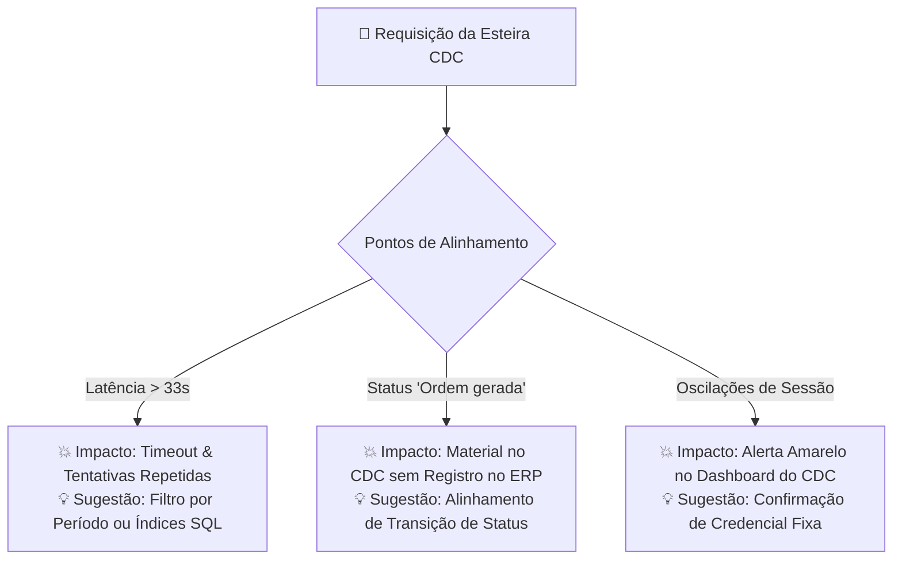

# 📄 Relatório de Alinhamento Técnico: Integração API v2 ONGSYS x CDC

**Para:** Equipe Técnica & Desenvolvimento — ONGSYS  
**De:** Equipe de Engenharia, TI & Automação — Centro de Desenvolvimento e Cidadania (CDC)  
**Assunto:** Diagnóstico de Integração, Evidências da API v2 e Sugestões de Otimização Mútua  
**Data:** 01 de Setembro de 2026  

---

## 🤝 1. Apresentação & Propósito de Parceria

Prezada equipe técnica do ONGSYS,

Este documento apresenta um **relatório amigável de alinhamento técnico e de governança**, referente à integração automatizada via **API REST v2** entre o sistema ONGSYS e o ERP do **Centro de Desenvolvimento e Cidadania (CDC)**.

Entendemos perfeitamente que integrações entre plataformas distintas envolvem desafios contínuos de infraestrutura, volumes crescentes de dados e particularidades operacionais. O nosso propósito com este relatório **não é apontar falhas**, mas sim compartilhar com transparência as **evidências empíricas sanitizadas** coletadas pela nossa esteira de monitoramento para que possamos, em conjunto:

1. **Reduzir atritos e erros de conexão automatizados**, otimizando o uso de processamento de ambas as infraestruturas.
2. **Garantir a fluidez na sincronização de materiais e suprimentos** direcionados aos projetos sociais e comunitários mantidos pelo CDC.
3. **Manter o Painel Institucional de Integrações** (`https://core.cdc.org.br/dashboard/integracoes/ongsys/`) 100% atualizado, refletindo o sucesso da parceria para gestores e auditores.

---

## 🌐 2. Matriz de Mapeamento Completo das APIs (v2)

Para dar total clareza sobre como a esteira do CDC consome o ambiente v2 do ONGSYS, realizamos testes diretos a partir do nosso servidor de produção. Abaixo está a matriz com a situação de cada rota identificada:

| Endpoint Mapeado | Status no Servidor ONGSYS | Diagnóstico & Uso na Integração do CDC |
| :--- | :--- | :--- |
| **`/api/v2/pedidos`** | 🟢 **Ativo (Rota Válida)** | **Endpoint Principal.** Utilizado para leitura de requisições de compra, materiais, itens e notas fiscais. |
| **`/api/v2/produtos`** | 🟢 **Ativo (Rota Válida)** | Utilizado para sincronização do catálogo de itens de estoque e especificações técnicas. |
| **`/api/v2/fornecedores`** | 🟢 **Ativo (Rota Válida)** | Utilizado para consulta e atualização de cadastros de fornecedores parceiros. |
| **`/api/v2/armazens`** | ⚠️ **HTTP 404 (Rota Inexistente)** | Rota não encontrada. O mapeamento de locais é realizado via centros de custo do endpoint `/pedidos`. |
| **`/api/v2/grupos`** | ⚠️ **HTTP 404 (Rota Inexistente)** | Rota não encontrada. O agrupamento de itens é inferido a partir dos atributos de `/produtos`. |
| **`/api/v2/unidademedida`** | ⚠️ **HTTP 404 (Rota Inexistente)** | Rota não encontrada. As unidades de medida (Un, Cx, Kg) são tratadas no payload do produto. |
| **`/api/v2/notas`** | ⚠️ **HTTP 404 (Rota Inexistente)** | Rota não encontrada. Confirmamos que as notas fiscais estão incorporadas no endpoint `/pedidos`. |

---

## 🔍 3. Diagnóstico Detalhado: Causa, Impacto Operacional & Sugestões

Apresentamos a seguir o raciocínio detalhado de cada desafio observado, demonstrando a causa técnica, o impacto real nas atividades de campo do CDC e a nossa sugestão de ganho mútuo.



---

### 📌 Ponto A: Tempo de Resposta (Latência) na Rota `/pedidos`

- **Causa Técnica / Motivo:** As chamadas efetuadas ao endpoint `/api/v2/pedidos` realizam junções (*joins*) de dados no banco do ONGSYS e levam entre **33 e 45 segundos** para retornar a resposta da primeira página.
- **Impacto Negativo no CDC:** Conexões padrão de clientes HTTP (com *timeout* padrão de 30s) abortam a leitura no meio do processo. A nossa esteira é forçada a realizar tentativas repetidas (*retries*), o que gera um **tráfego desnecessário e sobrecarga de CPU/RAM no próprio servidor do ONGSYS**, além de atrasar a atualização dos dados do CDC.
- **Sugestão de Ganho Mútuo:** 
  - Sugerimos a possibilidade de disponibilizar um filtro por período de data (ex: `?dataInicio=YYYY-MM-DD`) ou a revisão de índices SQL nas tabelas de pedidos do ONGSYS. 
  - *Benefício para ambos:* Reduz drasticamente a carga no servidor do ONGSYS e responde às consultas do CDC em menos de 5 segundos.

---

### 📌 Ponto B: Retenção de Ordens de Compra no Status `"Ordem gerada"`

- **Causa Operacional / Motivo:** O extrator automatizado do CDC lê o endpoint `/pedidos` e converte as ordens em movimentações de estoque. Para evitar duplicação ou entrada de compras que ainda passam por alterações no ONGSYS, a regra do sistema aguarda que a ordem atinja o status **`"Ordem finalizada"`**.
- **Impacto Negativo no CDC:** Insumos cruciais para projetos sociais (como materiais pedagógicos, recipientes e utensílios do *Projeto Atitude*) que **já foram entregues fisicamente nas unidades comunitárias do CDC** permanecem retidos com o status `"Ordem gerada"` no ONGSYS. Com isso, os materiais não aparecem no sistema do CDC e a equipe de atendimento na ponta fica sem visibilidade do saldo real disponível para distribuição às famílias atendidas.
- **Sugestão de Ganho Mútuo:** 
  - Sugerimos um alinhamento com as equipes operacionais do ONGSYS para marcarem a transição de status para `"Ordem finalizada"` assim que os materiais forem liberados/despachados, ou a definição de um parâmetro indicador de ordens prontas para recebimento.

---

### 📌 Ponto C: Oscilação de Resposta HTTP 500 & Credencial da API

- **Causa Técnica / Motivo:** Em momentos de oscilação do gerenciador de sessões do servidor parceiro (`ci_session`), chamadas de autenticação podem retornar `HTTP 500 Internal Server Error` em vez de mensagens tratadas (como `401 Unauthorized`).
- **Impacto Negativo no CDC:** O painel de governança do CDC (`https://core.cdc.org.br/dashboard/integracoes/ongsys/`) identifica a falta de comunicação e ativa o alerta de estado desatualizado (`sync_stale: true`), gerando falsos alarmes na gestão de TI.
- **Sugestão de Ganho Mútuo:** 
  - Sugerimos a confirmação ou reemissão de uma credencial/token fixo de API (`ONGSYS_USERNAME` e `ONGSYS_PASSWORD`) dedicado exclusivamente para a esteira do CDC, garantindo estabilidade contínua.

---

## 📊 4. Visibilidade & Transparência: O Dashboard de Integrações do CDC

Para demonstrar a relevância e o volume de dados gerenciados por essa integração, o CDC mantém um **Painel de Monitoramento Transparente em Tempo Real** acessível em `https://core.cdc.org.br/dashboard/integracoes/ongsys/`.

### Métricas Persistidas Atualmente no ERP do CDC:
- **📦 Movimentações de Estoque Importadas:** **2.151 pedidos** convertidos em entradas de estoque com controle estrito contra duplicidade (`duplicates_count: 0`).
- **🏭 Armazéns e Locais Mapeados:** **47 armazéns** de projetos sociais (*Atitude II.I, Bem Viver, Cais, ATM, etc.*).
- **🛒 Catálogo Unificado de Produtos:** **1.690 itens** cadastrados e rastreados.

Com o ajuste da credencial e o alinhamento das sugestões acima, este painel mudará seu indicador de `WARNING` para **`🟢 OK (100% Atualizado e Saudável)`**, comprovando a eficiência da parceria para ambas as instituições.

---

## 💡 5. Resumo das Sugestões Colaborativas

Gostaríamos de propor para apreciação da equipe do ONGSYS as seguintes **5 sugestões de melhoria contínua**:

1. **🔒 Confirmação de Credencial Fixa:** Validação da chave/hash dedicada para a integração.
2. **⚡ Possibilidade de Filtros por Data ou Índices SQL:** Redução do tempo de resposta na rota `/pedidos`.
3. **🔄 Alinhamento de Transição de Status:** Liberação de ordens para `"Ordem finalizada"` no momento do despacho.
4. **🔔 Notificações via Webhook (Opcional - Futuro):** Envio de aviso ativo ao CDC quando uma ordem for concluída.
5. **📖 Documentação / Swagger v2 (Se disponível):** Compartilhamento de atualizações do catálogo de campos da v2.

---

## 📎 Apêndice A: Registros de Logs Sanitizados da Esteira CDC

Para auxiliar os desenvolvedores do ONGSYS na análise interna, apresentamos os registros sanitizados capturados em nossas rotinas de teste.

### A.1. Exemplo de Timeout de Leitura (Read Timeout > 30s)
```text
[LOG INTEGRAL SANITIZADO - CDC ETL]
Data/Hora: 2026-08-30 14:15:22 UTC
Método: GET https://www.ongsys.com.br/app/index.php/api/v2/pedidos?pageNumber=1
Status: Conexão interrompida por estouro do tempo limite padrão (30s)
Erro Registrado: HTTPSConnectionPool(host='www.ongsys.com.br', port=443): Read timed out. (read timeout=30)
Medida Adotada pelo CDC: Aumento do tempo de espera no cliente para 120s para mitigar abortos.
```

### A.2. Exemplo de Cabeçalho de Erro HTTP 500 (Oscilação de Sessão)
```http
HTTP/2 500 Internal Server Error
Date: Mon, 31 Aug 2026 21:23:26 GMT
Content-Type: text/html; charset=utf-8
Server: cloudflare
Set-Cookie: ci_session=9afbcf6ec5929bdcd...; Path=/; HttpOnly
Expires: Thu, 19 Nov 1981 08:52:00 GMT
Cache-Control: no-store, no-cache, must-revalidate
```

### A.3. Amostra de Pedidos Represados no Status `"Ordem gerada"`
```json
[
  {
    "idPedido": 2728,
    "numeroPedido": "2728",
    "titulo": "Pedido do Atitude - INTENSIVO CABO - Container de Lixo",
    "statusPedido": "Ordem gerada",
    "tipoPedido": "Produto",
    "dataPedido": "2026-07-22",
    "diagnosticoCDC": "Aguardando transição para 'Ordem finalizada' para dar entrada no estoque"
  },
  {
    "idPedido": 2734,
    "numeroPedido": "2734",
    "titulo": "PEDIDO ATITUDE - BREVE JABOATÃO - MATERIAL PEDAGÓGICO",
    "statusPedido": "Ordem gerada",
    "tipoPedido": "Produto",
    "dataPedido": "2026-07-23",
    "diagnosticoCDC": "Aguardando transição para 'Ordem finalizada' para dar entrada no estoque"
  }
]
```

---

## 🤝 Conclusão

Reiteramos nosso profundo respeito e agradecimento à equipe técnica do ONGSYS. Estamos à disposição para agendar uma conversa rápida entre os times de TI para sanar qualquer dúvida e realizar testes de homologação em conjunto.

**Equipe de Engenharia, TI & Automação**  
*Centro de Desenvolvimento e Cidadania (CDC)*  
✉️ `tecnologia@cdc.org.br` | 🌐 `https://automatiza.cdc.org.br/`
