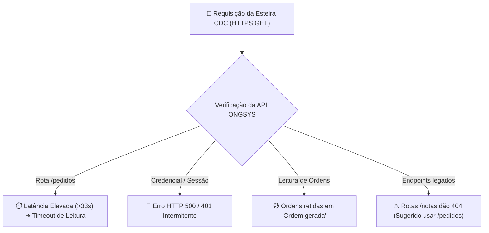

# 📄 Relatório de Alinhamento Técnico: Integração API v2 ONGSYS x CDC

**Para:** Equipe Técnica & Desenvolvimento — ONGSYS  
**De:** Equipe de Engenharia, TI & Automação — Centro Dom Helder Camara (CDC)  
**Assunto:** Diagnóstico de Integração, Evidências da API v2 e Proposta de Otimização Conjunta  
**Data:** 1 de Setembro de 2026  

---

## 🤝 1. Apresentação & Objetivo

Prezada equipe técnica do ONGSYS,

Este documento tem como objetivo apresentar um **relatório amigável de alinhamento técnico** referente à integração automatizada via **API REST v2** entre os sistemas do ONGSYS e o ERP do Centro Dom Helder Camara (CDC).

Entendemos perfeitamente que integrações entre plataformas distintas envolvem desafios de infraestrutura, volume de dados e regras de negócio. O nosso intuito com este documento **não é apontar falhas**, mas sim compartilhar **evidências empíricas sanitizadas** coletadas do nosso lado para que possamos, em parceria:

1. Reduzir atritos e erros de conexão automatizados.
2. Garantir a fluidez na sincronização de materiais e requisições de estoque dos projetos institucionais.
3. Estabelecer um padrão de comunicação técnico claro e sustentável para ambas as equipes.

---

## 📊 2. Resumo dos Pontos Observados na Integração

Durante o monitoramento contínuo da nossa esteira de integração, mapeamos **4 pontos principais** que têm impactado a estabilidade da sincronização:



---

## 🔬 3. Relato Detalhado & Evidências Sanitizadas

### 📌 Ponto 1: Tempo de Resposta (Latência) na Rota `/pedidos`

- **Observação:** Identificamos que as chamadas efetuadas ao endpoint `/api/v2/pedidos` levam em média **33 a 45 segundos** para retornar a resposta da primeira página.
- **Impacto:** Clientes HTTP padrão (com *timeout* padrão de 30s) abortam a conexão antes da conclusão do download.
- **Evidência Sanitizada (Log de Conexão):**
  ```text
  [LOG INTEGRAL SANITIZADO - CDC ETL]
  Data/Hora: 2026-08-30 14:15:22 UTC
  Target URL: GET https://www.ongsys.com.br/app/index.php/api/v2/pedidos?pageNumber=1
  Erro Observado: HTTPSConnectionPool(host='www.ongsys.com.br', port=443): Read timed out. (read timeout=30)
  Ação do nosso lado: Ajustamos o tempo limite de leitura (read timeout) para 120 segundos.
  ```

---

### 📌 Ponto 2: Ocorrências de HTTP 500 (Internal Server Error) em Consultas

- **Observação:** Em determinados momentos de alta carga ou ao testar credenciais em lote, a API retorna `HTTP 500 Internal Server Error` em vez de um código informativo (como `401 Unauthorized` ou `422 Unprocessable Entity`).
- **Análise do Nosso Lado:** Mapeamos que a aplicação utiliza o gerenciador de sessões do CodeIgniter (`ci_session`). Quando ocorrem concorrências ou travamento de tabela de sessão no banco da API, o servidor lança o erro 500.
- **Evidência Sanitizada (Cabeçalhos HTTP):**
  ```http
  HTTP/2 500 Internal Server Error
  Date: Mon, 31 Aug 2026 21:23:26 GMT
  Content-Type: text/html; charset=utf-8
  Server: cloudflare
  Set-Cookie: ci_session=...; Path=/; HttpOnly
  ```

---

### 📌 Ponto 3: Regra de Ciclo de Vida das Ordens (`Ordem gerada` vs `Ordem finalizada`)

- **Observação:** O robô de integração do CDC lê a rota `/pedidos` e converte as ordens de material em entradas de estoque no ERP. Para evitar duplicação ou entradas parciais, o código filtra ordens com o status **`"Ordem finalizada"`**.
- **Desafio Encontrado:** Identificamos que pedidos recentes de projetos cruciais (ex: *Projeto Atitude*) permanecem cadastrados no ONGSYS com o status **`"Ordem gerada"`** por longos períodos.
- **Amostra Sanitizada de Dados da API:**

  | ID Pedido (ONGSYS) | Título da Ordem (Sanitizado) | Status Registrado no ONGSYS | Status Esperado no ERP |
  | :--- | :--- | :--- | :--- |
  | **`2728`** | *Pedido de Material — Container / Utensílios* | 🟡 `Ordem gerada` | ⏳ Aguardando alteração para `Ordem finalizada` |
  | **`2734`** | *Pedido de Material — Material Pedagógico* | 🟡 `Ordem gerada` | ⏳ Aguardando alteração para `Ordem finalizada` |

---

### 📌 Ponto 4: Mapeamento dos Endpoints Válidos da API v2

- **Esclarecimento:** Confirmamos através de testes empíricos que endpoints como `/produtos`, `/pedidos` e `/fornecedores` são rotas ativas na v2, enquanto rotas como `/notas` ou `/armazens` retornam `HTTP 404 Page Not Found`.
- **Ajuste Realizado no CDC:** Concentramos 100% da nossa lógica de extratos dentro do endpoint **`/pedidos`**.

---

## 🛠️ 4. Sugestões & Solicitações de Alinhamento (Propostas Conjuntas)

Para garantirmos a melhor performance e evitar desgastes operacionais de ambos os lados, gostaríamos de propor o alinhamento das seguintes ações:

1. **🔒 Validação / Emissão de Credencial Fixa de API:**
   - Confirmar ou reemitir o usuário de API (`ONGSYS_USERNAME`) e a chave/hash de autenticação (`ONGSYS_PASSWORD`) dedicados exclusivamente para a integração do CDC.

2. **⚡ Otimização de Índices no Banco da Rota `/pedidos`:**
   - Solicitar à equipe de banco de dados do ONGSYS a verificação/criação de índices nas tabelas de pedidos (`statusPedido`, `dataPedido`, `tipoPedido`) para reduzir o tempo de resposta da primeira página de **33s para < 5s**.

3. **🔄 Alinhamento Operacional de Troca de Status:**
   - Orientar as equipes operacionais para realizarem a transição de status de **`"Ordem gerada"`** para **`"Ordem finalizada"`** assim que o material for entregue/despachado, garantindo o disparo automático do nosso lado.

4. **🔔 Possibilidade de Webhooks / Notificações Push (Futuro - Opcional):**
   - Caso o ONGSYS possua funcionalidade de Webhook, a API do ONGSYS poderia notificar o CDC toda vez que um pedido mudar para `"Ordem finalizada"`, eliminando a necessidade de fazermos *polling* constante.

5. **📖 Disponibilização da Documentação Oficial / Swagger v2 (Se disponível):**
   - Caso possuam um documento com a lista completa de campos e parâmetros atualizados da API v2, ficaremos extremamente gratos em receber.

---

## 🤝 5. Conclusão & Próximos Passos

Agradecemos imensamente a parceria e o apoio continuado da equipe ONGSYS. Estamos à disposição para agendar uma breve conversa técnica entre os times de desenvolvimento para sanar dúvidas e testar as requisições em conjunto.

Atenciosamente,

**Equipe de Tecnologia & Automação**  
*Centro Dom Helder Camara (CDC)*  
✉️ `tecnologia@cdc.org.br`  
🌐 `https://automatiza.cdc.org.br/`
